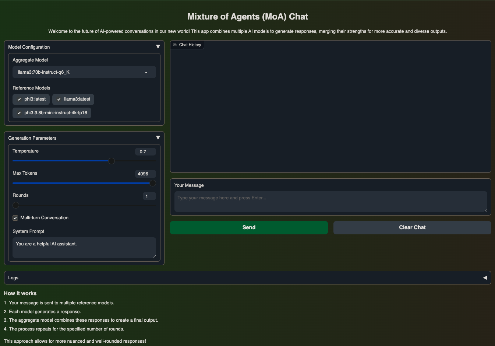

# Mixture-of-Agents (MoA) Chat Application

This is an advanced implementation of the Mixture-of-Agents (MoA) concept, adapted from the original work by TogetherAI. This version is tailored for local model usage and features a user-friendly Gradio interface.

## What is MoA?

Mixture of Agents (MoA) is a cutting-edge approach that leverages multiple Large Language Models (LLMs) to enhance AI performance. By utilizing a layered architecture where each layer consists of several LLM agents, MoA achieves state-of-the-art results using open-source models.

## Gradio Interface



## Key Features

- **Multi-Model Integration**: Combines responses from multiple AI models for more comprehensive and nuanced outputs.
- **Customizable Model Selection**: Users can choose and configure both reference and aggregate models.
- **Adjustable Parameters**: Fine-tune generation with customizable temperature, max tokens, and processing rounds.
- **Real-Time Streaming**: Experience fluid, stream-based response generation.
- **Intuitive Gradio Interface**: User-friendly UI with an earth-toned theme for a pleasant interaction experience.
- **Flexible Conversation Modes**: Support for both single-turn and multi-turn conversations.

## How It Works

1. User input is processed by multiple reference models simultaneously.
2. Each reference model generates its unique response.
3. An aggregate model combines and refines these responses into a final output.
4. This process can be repeated for multiple rounds, enhancing the quality of the final response.

## Setup and Configuration

1. Clone the repository and navigate to the project directory.

2. Set up your environment:

   ```shell
   cp .env.example .env
   vi .env
   ```

3. Install requirements:

   ```shell
   conda create -n moa python=3.10
   conda activate moa
   pip install -r requirements.txt
   ```

## Configuration

Edit the `.env` file to configure the following parameters:

```bash
API_BASE=http://localhost:11434/v1
API_KEY=ollama

API_BASE_2=http://localhost:11434/v1
API_KEY_2=ollama

MAX_TOKENS=4096
TEMPERATURE=0.7
ROUNDS=1

MODEL_AGGREGATE=llama3:70b-instruct-q6_K

MODEL_REFERENCE_1=phi3:latest 
MODEL_REFERENCE_2=llama3:latest
MODEL_REFERENCE_3=phi3:3.8b-mini-instruct-4k-fp16

OLLAMA_NUM_PARALLEL=4  
OLLAMA_MAX_LOADED_MODELS=4
```

## Running the Application

1. Start the Ollama server:

   ```shell
   OLLAMA_NUM_PARALLEL=4 OLLAMA_MAX_LOADED_MODELS=4 ollama serve
   ```

2. Launch the Gradio interface:

   ```shell
   conda activate moa
   gradio app.py
   ```

3. Open your web browser and navigate to the URL provided by Gradio (usually http://localhost:7860).

## Advanced Usage

- **Model Customization**: Easily switch between different aggregate models to suit your needs.
- **Parameter Tuning**: Adjust temperature, max tokens, and rounds to control the output's creativity and length.
- **Multi-Turn Conversations**: Enable or disable context retention for more dynamic interactions.

## Contributing

We welcome contributions to enhance the MoA Chat Application. Feel free to submit pull requests or open issues for discussions on potential improvements.

## License

This project is licensed under the terms specified in the original MoA repository. Please refer to the original source for detailed licensing information.

---

<div align="center">
  
</div>
